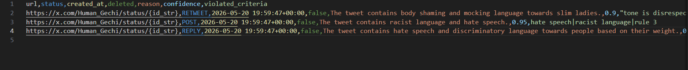

# tweet-audit

Audit your X (Twitter) archive with Groq and export flagged tweets to CSV.

## What this project does

- Unzips your X archive (`.zip`)
- Loads tweets from the archive JS file
- Sends tweet text to Groq for policy/alignment review
- Saves flagged tweets (with reasons/confidence) to CSV

## Project files

- Entry script: [src/main.py](src/main.py)
- Archive unzip logic: [src/archive_parser.py](src/archive_parser.py)
- Prompt builder: [src/prompt.py](src/prompt.py)
- Groq analysis + batching: [src/groq.py](src/groq.py)
- Helpers + CSV writer: [src/utils/helpers.py](src/utils/helpers.py)
- Config validation: [src/utils/config_validate.py](src/utils/config_validate.py)
- Logging setup: [log.py](log.py)
- Tests: [tests/test_archive_parser.py](tests/test_archive_parser.py), [tests/test_helpers.py](tests/test_helpers.py)
- Tradeoffs doc: [TRADEOFFS.md](TRADEOFFS.md)

## Setup

1. Create and activate a virtual environment.
2. Install dependencies:

```bash
pip install -r requirements.txt
```

3. Copy config template and edit values:

```bash
cp config.example.json config.json
```

> On Windows PowerShell:
> `Copy-Item config.example.json config.json`

## Configuration

Edit [config.json](config.json). Key sections used by the app:

- `groq_api_key` (or environment variable `GROQ_API_KEY`)
- `groq_settings`
- `alignment_criteria`
- `account_context`
- `prompt_settings`
- `archive_settings`
- `output_settings`
- `filter_settings`

You can validate config through the validator in [src/utils/config_validate.py](src/utils/config_validate.py).

## How to run

Place your X archive zip where `archive_settings.archive_path` points, then run:

```bash
python src/main.py
```

The run flow in [src/main.py](src/main.py):

1. Unzip archive
2. Validate config
3. Process tweets
4. Analyze with Groq
5. Write flagged CSV

## Output

Flagged tweets are saved to the path defined in `output_settings` (example output: [output/flagged_tweets.csv](output/flagged_tweets.csv)).

## Tests

Run test suite with:

```bash
pytest -v
```

Pytest config: [pytest.ini](pytest.ini)

---

## Images / demo note

Screenshots can be stored in [images/](images/).

**Testing disclosure:**
For verification, the tweet data was intentionally modified to include offensive language and edge-case content so the flagging pipeline could be validated against expected behavior.





## Notes

- Keep real personal data private before sharing archives.
- Do not commit secrets in [config.json](config.json). Use environment variables where possible.
- Review [TRADEOFFS.md](TRADEOFFS.md) for known limitations.